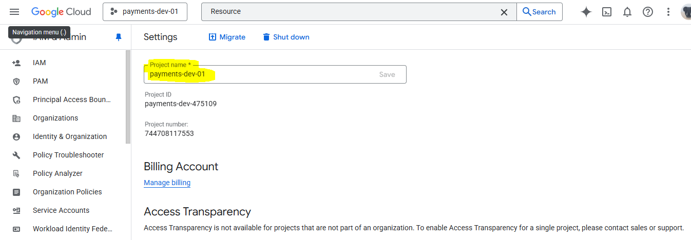
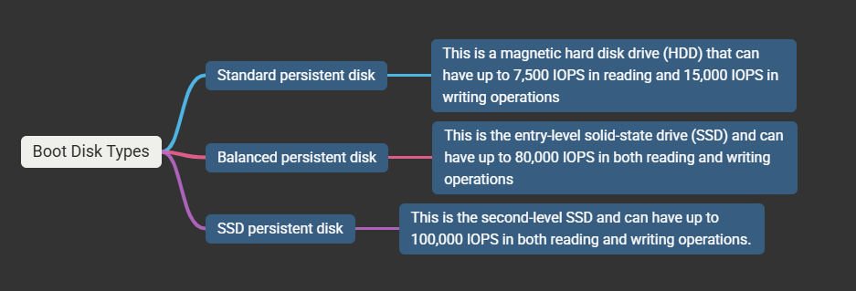

# Google cloud platform infrastructure

## Google Cloud Computing and Virtualization

The cloud computing model is based on several important pillars.

1. (What is) Data center : A massive physical infrastructure (along with the continuous 24 \* 7 power supply, cooling mechanism, clean or dust free space) which includes a large number of servers, storage and networking devices.

- Internal View : 
- External View : 
- Building View : 

## Why Datacenters?

- It is a foundation of digital services, it provides physical infrastructure like servers, storage, and networking equipment. Which host your websites, applications, cloud services and online transactions.
- Business continuity and operations : They support critical business functions by hosting applications. Continuous execution of services or say high availability of the services.
- Data storage, security and management : A centralized secured location for the organization's data, with robust security measures, also helpful for managing and analyzing, and make sense of business data.
- Reliability and Data Recovery : If primary part fails, it ensures continuous services and increased reliability. It ensures continuous operations and protect against disruptions. It restores data quickly after an unforseen event.

---

# 2. (What is) Virtualization :

- Virtualization is the process of creating virtual, simulated versions of physical computer resources, like servers, storage, and networks, using software. This allows a single physical machine to be partitioned into multiple isolated virtual machines (VMs), each with its own operating system and applications, sharing the same hardware resources.
- Virtualization is a process for users to create multiple simulated environments within one piece of hardware.
- Virtualization creates a type of virtual barrier—called a hypervisor—to separate digital functions normally requiring multiple physical units.

Virtualization Concept: 

- The initial piece of hardware operating a VM is called the host.
- VMs operating in harmony within the host are called the guests.
- When virtualization allows multiple operating systems to run at the same time on one machine, the combination of systems is called a virtual machine (VM)

## Why Virtualization:

- Cost saving for running multiple virtual machines on a single physical host machine. (or sometimes say server)
- It reduces operating costs for power, cooling and physical space.
- IT Business Efficiency and Flexibility.
- Virtualization provides an extremely reliable system with no single point of failure in hardware or software

# 3. Programmability

- The resources created on the cloud is software driven. (like consider resources on cloud as an Object).
- In the cloud, everything — like computers (compute), hard drives (storage), and internet connections (network) — can be controlled by software instead of people doing it manually.
- So instead of calling a technician or sending an email to request a new server or more storage, you just click a button or use code, and the cloud automatically sets it up for you within seconds.
- That’s what programmability means — everything can be created, changed, or deleted automatically through software or code, not by humans doing manual setup.
- Old way: You’d ask the IT department → they buy and set up a physical server → might take days or weeks.
- Cloud way: You log into AWS, Azure, or Google Cloud → click “Create new server” → it’s ready in minutes.

# 4. Global Network

- It has global private physical network that interconnects all the data centers around the world.
- Consumers can rent these services from cloud providers on-demand in a self-service manner.
- This model allows cloud users to pay only for the resources they reserve and consume, thus reducing Capital Expenditure (CAPEX) and time-to-market.

---

# Cloud Computing Built On 5 Fundamental Attributes

# There are 3 Kinds of Cloud Services that user can choose from.

## 

---

# Google Cloud Global Infrastructure - Regions and Zones

- The customers who decide to deploy their cloud services on GCP will benefit from the highest throughput and the lowest latency (Project Andromeda). Google offers connection to their cloud services from over 200 network edge locations.
- As well as via private and public internet exchange locations.
- The edge location connections established through the following
  - Cloud Interconnect
  - Verified Peering Provider
  - Direct Peering

## Google Global Network: 

- GCP data centers are organized into regions and zones around the globe and are interconnected with Google's physical private network.
- Regions are independent geographic areas that include three or more zones.
- To design a robust and failure-tolerant cloud infrastructure, it is important to deploy resources across zones or even regions. This prevents you from having an infrastructure outage that affects all resources simultaneously.

- You must know where the Resource Belong to
  

---

# Choosing a region and a zone where your resources should be deployed, as well as where data should be stored, is an especially important design task.

## Why ?

---

### How to get all the compute regions list?

- Execute below command in Cloud Shell and see the list of All Regions

$ gcloud compute regions list

- The full list of available zones can also be queried.

$ gcloud compute zones list | more

---

# Each zone supports several types of CPU Platforms

- This is an important aspect to know when you decide to deploy your virtual machine instance in one particular zone. You need to make sure that the zone you choose supports the instance that you are willing to deploy.

### To find out what CPU platform one zone supports, then use following command.

$ gcloud compute zones describe asia-south1-a

## Communication within and across regions will have different costs.

- Communication within region will always be cheaper and faster.
- Communication accross different regions costs some than within the region.

## Apply multi-zone redundency to critical systems:

- To mitigate the effects of unexpected failure on your instances, you should duplicate critical assets in multiple zones and regions.

---

## GCP resources belong to exactly one project and they cannot be shared across projects, except for shared VPC networks, which can be shared with other projects.

## The GCP Projects have 3 identifying attributes.

1. Project ID : Unique across GCP globally, you can choose the name at the project creation time only. You can not modify Project ID once it is created.

### how to edit Project ID:

## After clicking on Edit, you can assign your own name for the project id. (one time activity)

2. Project Name: Unique across GCP globally, you can rename it at any time. At the time of creation as well after project creation it can be modifiable.

Select Manage Resources from the menu and select your project to rename it.

You can modify it at any time (After creation of the project it is possible too)

3. Project Number: The project number is permanent and it is immutable and unique across GCP globally. It can not be modified after creating the project and also user doesn't have any control to modify it at the time of creation as we have done it for the Project ID.

---

# Project must belong to a billing account, which is used for billing resources. One billing account can have multiple projects assigned.

- The cloud billing account is responsible for tracking all the costs that are incurred using the GCP resources for all the projects attached to it

---

# Google cloud quotas

- Projects can have different quotas for the same services. This may depend on various aspects; for example, the quota administrator may reduce the quota for certain resources to equalize the number of services among all projects in one organization.

### Google cloud uses two categories of quotas.

## Google Cloud Quotas and System Limits is present into the Google Cloud IAM

### Project wise quotas can be assigned in GCP and you will get an Idea about the usage of resources too.

---

# Google Cloud Resource Hierarchy

---

1. Google Cloud’s “resource hierarchy”:
   Think of your Google Cloud setup like a family tree:
   At the top is your Organization (your whole company).
   Under it, you can have Folders (like departments).
   Inside folders, you have Projects (where you actually run apps, store data, etc.).
   Each project can have Resources (like virtual machines, storage buckets, databases, etc.).
   So, it’s Organization → Folder → Project → Resource.

2. IAM (Identity and Access Management)

- IAM controls who can do what on which resources.

- Who = users, groups, or service accounts.
- What = permissions (e.g., read, write, delete).
- Which = specific Google Cloud resources (e.g., a project, bucket, VM).

3. IAM policies at different levels:
   You can set access rules (policies) at any level:

- Organization level (affects everything below)
- Folder level (affects all projects/resources inside)
- Project level (affects all resources in the project)
- Resource level (specific to that one resource)
- Policies at higher levels are inherited by the lower levels.

4. “Union” of policies:

- If multiple IAM policies apply (for example, one at the project and another at the resource), Google combines them. It doesn’t pick just one — it takes the union (the combination) of all permissions.

✅ That means:
If a user has permission at the organization level and another at the project level, they get both permissions on the resource.

🧠 Example
Let’s say:

- The organization gives Alice permission to view all resources.
- The project gives her permission to edit storage buckets.
  → When Alice looks at a bucket, she can view + edit it (because the permissions are combined).

---

# Google compute engine

- IaaS in GCP is implemented with Compute Engine.

- The use cases for Compute Engine are as follows:
  Websites
  Legacy monolithic applications
  Custom databases
  Microsoft Windows applications

- Compute Engine is a regional service.
- Note that the instance must be unique within the zone.
- GCP allows administrators to deploy Compute Engine VMs with the same name, so long as they stay in different zones
  for e.g. Let us-central1-a VM name as "production-vm" then us-central1-b also allow the same name as "production-vm".

# Virtual Machine Family Types.

# General Purpose Category

# General Purpose Examples

# Machine type configurations in GCP

---

# Boot Disk

- Each virtual machine instance requires a boot disk to run properly.
- In the boot disk, the operating system is installed, as well as the main partition.
- The boot disk is a permanent storage disk and it can be built from several types of images.
- GCP offers pre-built public images for both Linux and Windows operating systems

## Boot Disk Types

- Boot disks are the primary disks for a Compute Engine instance.
- Additionally, you can attach more disks to your virtual machine if you need extra space or for extremely high performance.
- They are physically attached to the server that hosts your Compute Engine instance and can have up to 0.9/2.4 million IOPS in reading and 0.8/1.2 million IOPS in writing (with SCSI and NVMe technology, respectively).
- Security is a particularly important feature when you design your Compute Engine instance.
- Google lets you choose from three different encryption solutions that apply to all the persistent disks of your virtual machine.
  

---
